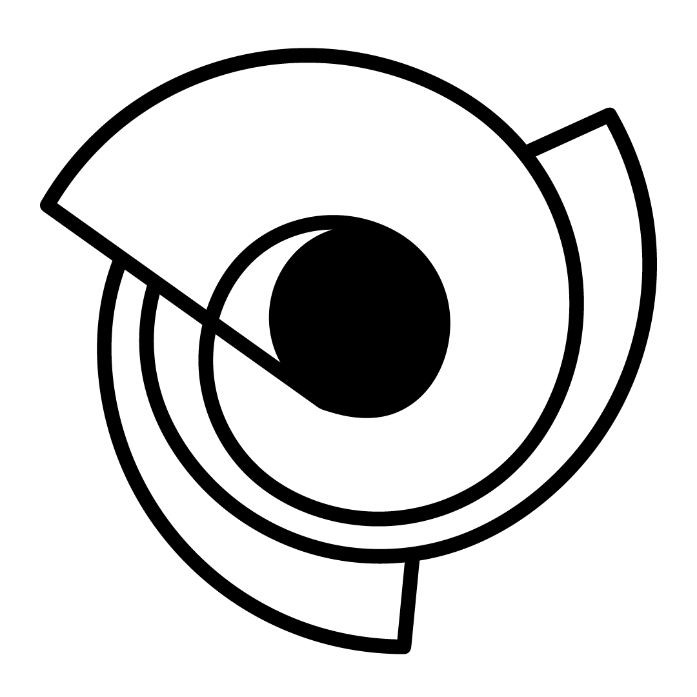

<div align="center" id="short-description-and-logo">

  <!-- Logo -->
  

This is the documentation for the **[whirl API](https://whirl-api.onrender.com)** which provides endpoints for managing users and quizzes.

The API is built using Node.js and Express, and it follows RESTful conventions.

</div>

## Base URL

The base URL for the API is `https://whirl-api.onrender.com`.

## Users

### User CRUD operations

<details open>

  <summary>Get all users</summary>

- Endpoint: `/users`
- Method: `GET`
- Controller Method: `UserController.getAll`
- Description: Retrieve a list of all users.

</details>

<details open>
  <summary>Create a new user</summary>

- Endpoint: `/users`
- Method: `POST`
- Controller Method: `UserController.create`
- Description: Create a new user.

</details>

<details open>
  <summary>Get user by ID</summary>

- Endpoint: `/users/:id`
- Method: `GET`
- Controller Method: `UserController.getFromId`
- Description: Retrieve a user by their ID.

</details>

<details open>
  <summary>Delete user by ID</summary>

- Endpoint: `/users/:id`
- Method: `DELETE`
- Controller Method: `UserController.remove`
- Description: Delete a user by their ID.

</details>

### User's own quizzes

<details open>
  <summary>Get user's own quizzes</summary>

- Endpoint: `/users/:id/quizzes`
- Method: `GET`
- Controller Method: `UserController.getUserOwnQuizzes`
- Description: Get the quizzes owned by a user by their ID.

</details>

### Update image for User

<details open>
  <summary>Update user image by ID</summary>

- Endpoint: `/users/:id/image`
- Method: `PUT`
- Controller Method: `UserController.updateUserImage`
- Description: Update the image of a user by their ID.
- Authorization: Requires the user to be authenticated.

</details>

### User's followed quizzes

<details open>
  <summary>Get user's followed quizzes</summary>

- Endpoint: `/users/:id/following`
- Method: `GET`
- Controller Method: `UserController.getUserFollowedQuizzes`
- Description: Get the quizzes followed by a user by their ID.
- Authorization: Requires the user to be authenticated as a super admin.

</details>

<details open>
  <summary>Add quiz to user's followed quizzes</summary>

- Endpoint: `/users/:id/following`
- Method: `PUT`
- Controller Method: `UserController.addToUserFollowedQuizzes`
- Description: Add a quiz to the list of quizzes followed by a user by their ID.

</details>

<details open>
  <summary>Remove quiz from user's followed quizzes</summary>

- Endpoint: `/users/:id/following`
- Method: `DELETE`
- Controller Method: `UserController.removeFromUserFollowedQuizzes`
- Description: Remove a quiz from the list of quizzes followed by a user by their ID.

</details>

## Quizzes

### Quiz CRUD Operations

<details open>
  <summary>Get all quizzes</summary>

- Endpoint: `/quizzes`
- Method: `GET`
- Controller Method: `QuizController.getAll`
- Description: Retrieve a list of all quizzes.

</details>

<details open>
  <summary>Create a new quiz</summary>

- Endpoint: `/quizzes`
- Method: `POST`
- Controller Method: `QuizController.create`
- Description: Create a new quiz.

</details>

<details open>
  <summary>Get quiz by ID</summary>

- Endpoint: `/quizzes/:id`
- Method: `GET`
- Controller Method: `QuizController.getFromId`
- Description: Retrieve a quiz by its ID.

</details>

<details open>
  <summary>Delete quiz by ID</summary>

- Endpoint: `/quizzes/:id`
- Method: `DELETE`
- Controller Method: `QuizController.remove`
- Description: Delete a quiz by its ID.

</details>

### Visibility Operations

<details open>
  <summary>Get quiz visibility</summary>

- Endpoint: `/quizzes/:id/visibility`
- Method: `GET`
- Controller Method: `QuizController.getQuizVisibility`
- Description: Retrieve the visibility of a quiz by its ID.

</details>

<details open>
  <summary>Toggle quiz visibility</summary>

- Endpoint: `/quizzes/:id/visibility`
- Method: `PUT`
- Controller Method: `QuizController.toggleQuizVisibility`
- Description: Toggle the visibility of a quiz by its ID.
- Authorization: Requires the user to be authenticated.

</details>

### Views Operations

<details open>
  <summary>Get quiz views</summary>

- Endpoint: `/quizzes/:id/views`
- Method: `GET`
- Controller Method: `QuizController.getQuizViews`
- Description: Retrieve the views of a quiz by its ID.

</details>

<details open>
  <summary>Increment quiz views</summary>

- Endpoint: `/quizzes/:id/views`
- Method: `PUT`
- Controller Method: `QuizController.incrementQuizViews`
- Description: Increment the views of a quiz by its ID.
- Authorization: Requires the user to be authenticated.

</details>

### Rating Operations

<details open>
  <summary>Get quiz rating</summary>

- Endpoint: `/quizzes/:id/rating`
- Method: `GET`
- Controller Method: `QuizController.getQuizRating`
- Description: Retrieve the rating of a quiz by its ID.

</details>

<details open>
  <summary>Update quiz rating</summary>

- Endpoint: `/quizzes/:id/rating`
- Method: `PUT`
- Controller Method: `QuizController.updateQuizRating`
- Description: Update the rating of a quiz by its ID.
- Authorization: Requires the user to be authenticated.

</details>

### Followers Operations

<details open>
  <summary>Get quiz followers</summary>

- Endpoint: `/quizzes/:id/followers`
- Method: `GET`
- Controller Method: `QuizController.getQuizFollowers`
- Description: Retrieve the followers of a quiz by its ID.

</details>

### Genres Operations

<details open>
  <summary>Add genre to quiz</summary>

- Endpoint: `/quizzes/:id/genres`
- Method: `POST`
- Controller Method: `QuizController.addGenreToQuiz`
- Description: Add a genre to a quiz by its ID.
- Authorization: Requires the user to be authenticated.

</details>

<details open>
  <summary>Remove genre from quiz</summary>

- Endpoint: `/quizzes/:id/genres/:genreId`
- Method: `DELETE`
- Controller Method: `QuizController.removeGenreFromQuiz`
- Description: Remove a genre from a quiz by its ID and the genre ID.
- Authorization: Requires the user to be authenticated.

</details>

### Image Operations

<details open>
  <summary>Update quiz image</summary>

- Endpoint: `/quizzes/:id/image`
- Method: `PUT`
- Controller Method: `QuizController.updateQuizImage`
- Description: Update the image of a quiz by its ID.
- Authorization: Requires the user to be authenticated, and own the quiz.

</details>

## Genres

### Genre CRUD operations

<details open>
  <summary>Create a new genre</summary>

- Endpoint: `/genres`
- Method: `POST`
- Controller Method: `GenreController.createGenre`
- Description: Create a new genre for quizzes.

</details>

<details open>
  <summary>Get all genres</summary>

- Endpoint: `/genres`
- Method: `GET`
- Controller Method: `GenreController.getAllGenres`
- Description: Retrieve a list of all genres.

</details>

<details open>
  <summary>Delete genre by ID</summary>

- Endpoint: `/genres/:id`
- Method: `DELETE`
- Controller Method: `GenreController.removeGenre`
- Description: Delete a genre by its ID.

</details>

### Genre's image

<details open>
  <summary>Update genre by ID</summary>

- Endpoint: `/genres/:id`
- Method: `PUT`
- Controller Method: `GenreController.updateGenreName`
- Description: Update the name of a genre by its ID.

</details>

## Authentication

<details open>
  <summary>Login and Token Retrieval</summary>

- Endpoint: `/auth`
- Method: `GET`
- Controller Method: `AuthController.login`
- Description: Retrieve login information.

</details>

<details open>
  <summary>Token Callback</summary>

- Endpoint: `/auth/callback`
- Method: `GET`
- Controller Method: `AuthController.getTokens`
- Middleware: `validateOAuthToken`
- Description: Callback endpoint for retrieving tokens. The middleware `validateOAuthToken` is applied to validate the OAuth token before creating a new user.

</details>

<details open>
  <summary>Generate Access Token</summary>

- Endpoint: `/auth/new-token`
- Method: `GET`
- Controller Method: `AuthController.generateAccessToken`
- Description: Generate a new access token.

</details>

## Server Status

<details open>
  <summary>Check server status</summary>

- Endpoint: `/`
- Method: `GET`
- Description: Check if the server is running.
- Response: Returns a "server is running" message with a status code of 200.

</details>

## Usage

You can use the provided routes to interact with the whirl API. Ensure that you follow RESTful principles and include the necessary data in your requests.

Feel free to explore and integrate these endpoints into your application.

### Example

```bash
curl https://whirl-api.onrender.com/quizzes -X GET
```
